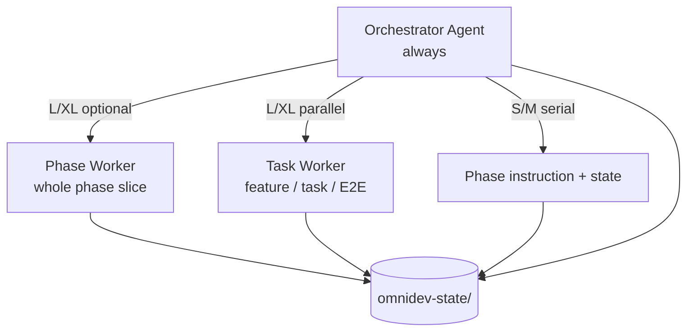

# Multi-Agent Architecture (Recommended)

**Model**: **Orchestrator + Selective Phase Workers + Task Workers** — not「一阶段一常驻 Agent」.

→ Platform dispatch: SKILL.md §F.3 · Token policy: [token-optimization.md](token-optimization.md) §2

---

## 1. Design Principle

| Principle | Rule |
|-----------|------|
| **One orchestrator always** | User interaction, routing, checkpoint, B.0, merge, `/od re` — **only** main agent |
| **Workers are ephemeral** | Spawn → write disk → ≤30 line summary → exit; never hold user session |
| **State files are the contract** | Workers read/write `docs/omnidev-state/` only; no worker-to-worker chat |
| **Spawn when ROI > cost** | S/M serial; L/XL parallel when ≥3 units OR heavy I/O isolation |
| **Phase 0/1/5 default serial** | Light, interactive, or consent-heavy — orchestrator direct |

---

## 2. Three Tiers



| Tier | Role | Count | Examples |
|------|------|-------|----------|
| **T0 Orchestrator** | 主编排 | 1 per session | activation, checkpoint, interactive prompt, merge conflicts |
| **T1 Phase Worker** | 整阶段外包（可选） | 0–2 per requirement | Phase 2 planning bundle, Phase 5 deploy bundle |
| **T2 Task Worker** | 阶段内并行（现有 sub_agents） | 0–N | feature design, dev task, E2E runner |

---

## 3. Agent Roster（推荐 5 类 Worker，非 6 阶段 Agent）

| Worker type | Phase | Trigger (auto) | Delivers |
|-------------|-------|----------------|----------|
| **Explorer** | 0, 1 | monorepo OR L/XL blueprint | stack scan, approach research summary |
| **Feature** | 2 | L/XL + features ≥5 | `features/FN.md` + feature test tables |
| **Dev** | 3 | L/XL + ≥3 independent tasks in group | code + UNIT for assigned task(s) |
| **QA-E2E** | 4 | `e2e_required` + specs≥3 OR `allow_e2e_sub_agent` | Playwright run summary only |
| **Deploy** | 5 | XL OR `deploy_autonomy: full` | Makefile + `deploy/**/deploy.sh` one-click |

**Orchestrator direct (no worker)** — default for:

| Phase | Why |
|-------|-----|
| 0 | User complexity confirmation, interactive |
| 1 | Approach selection, B.0 assumptions |
| 2 | M or features <5 — serial plan merge |
| 3 | M or <3 tasks — serial dev + Change Impact |
| 4 | UNIT / INT / SMK / REG — I/O serial, orchestrator |
| 5 | conservative legacy — audit + consent before Makefile edits |

---

## 4. Spawn Decision Matrix

### 4.1 By complexity

| Complexity | T1 Phase Worker | T2 Task Worker |
|------------|-----------------|----------------|
| **S** | Never | Never |
| **M** | Never | Never (except user override `sub_agents: on`) |
| **L** | Phase 2 if features≥5; Phase 5 if user requests full deploy | Phase 2 Feature; Phase 3 Dev if ≥3 tasks |
| **XL** | Phase 2 bundle; Phase 5 deploy bundle | All eligible T2 workers |

### 4.2 Cost gate (auto mode)

Spawn worker only if **all** true:

1. Complexity L or XL (or `sub_agents: on`)
2. Parallelizable units ≥3 (features, tasks, or E2E specs)
3. Estimated save > platform overhead:

   | Platform | Overhead per spawn |
   |----------|-------------------|
   | Cursor / Claude | ~8000 tokens |
   | Codex thread | ~4000 tokens |

4. No shared-file write conflict (different `outputs` paths or different features)

If gate fails → orchestrator serial.

---

## 5. Worker Contract (Handoff)

### 5.1 Input packet (orchestrator → worker)

```yaml
worker_id: feature-F3-20260704
worker_type: feature | dev | qa-e2e | deploy | explorer
phase: 2
read_only:
  - docs/omnidev-state/00-project-context.md   # slice per context-lifecycle
  - docs/omnidev-state/[branch]/session-log.md # YAML only
write:
  - docs/omnidev-state/[branch]/features/F3.md
  - docs/omnidev-state/[branch]/05-test-plan.md  # § F3 sections only
forbidden:
  - checkpoint / interactive prompt
  - git commit / production deploy
  - loading *-history.md full snapshots
return_format: ≤30 lines markdown summary
```

### 5.2 Output (worker → orchestrator)

```markdown
## Worker Summary: feature-F3
Status: ✅ complete | ⚠️ partial | ❌ failed
Files written: [paths]
TC-IDs added: [TC-F3-U01..]
Blockers: [none | description]
```

Orchestrator: Read files from disk → merge index/traceability → checkpoint → user prompt.

### 5.3 Conflict resolution

| Conflict | Action |
|----------|--------|
| Two workers same file | Abort both outputs; orchestrator serial retry |
| Worker fail | Log in `03-progress.md`; orchestrator retry once narrower scope |
| Partial write | Orchestrator completes missing sections serial |

---

## 6. Phase Worker (T1) — Optional Bundles

Use sparingly; only when T2 alone insufficient.

### Phase 2 Planning Bundle

**When**: XL + features≥8 OR user `/od al` on Phase 2.

**Worker receives**: Phase 2 instruction header + `00-project-context` + blueprint slice.

**Worker produces**: all `features/*.md`, `05-test-plan.md` layers, draft `02-plan.md` traceability.

**Orchestrator**: Review merge, archive if revision, checkpoint.

### Phase 5 Deploy Bundle

**When**: XL OR `deploy_autonomy: full`.

**Worker produces**: Makefile, `deploy/deploy.sh`, three one-click mode scripts.

**Orchestrator**: Audit table, release notes, user confirm before prod execute.

---

## 7. Platform Mapping

| Worker | Cursor | Claude Code | Codex |
|--------|--------|-------------|-------|
| T2 Task | built-in worker | `Task` | `create_thread` + `send_message_to_thread` |
| T1 Phase | built-in worker (long prompt) | `Task` (phase scope) | dedicated thread per phase bundle |

Same contract all platforms.

---

## 8. Config

```json
{
  "sub_agents": "auto",
  "phase_workers": "auto",
  "allow_e2e_sub_agent": true,
  "deploy_autonomy": "conservative"
}
```

| Key | Values | Effect |
|-----|--------|--------|
| `sub_agents` | off / auto / on | T2 Task Workers (existing) |
| `phase_workers` | off / auto / on | T1 Phase Workers (§6 bundles) |
| `allow_e2e_sub_agent` | bool | T2 QA-E2E in Phase 4 |
| `deploy_autonomy` | conservative / full | Phase 5 Deploy Worker eligibility |

**Recommended defaults**: `sub_agents: auto`, `phase_workers: auto`, `phase_workers: off` for S/M-only teams.

---

## 9. What NOT to Do

| ❌ Anti-pattern | ✅ Instead |
|----------------|-----------|
| 6 permanent phase agents | Orchestrator + ephemeral workers |
| Worker shows checkpoint to user | Orchestrator only |
| Worker reads full conversation | State slice + worker packet |
| Phase 4 spawn for UNIT/INT | Orchestrator serial; QA-E2E only |
| S-level spawn any worker | Serial only |
| Workers merge without disk read | Orchestrator reads disk to merge |

---

## 10. Summary —「最合适」方案一句话

> **1 个 Orchestrator 贯穿全程 + L/XL 按需派 ephemeral Task Worker（Phase 2/3/E2E）+ 极少数 Phase Worker 整包（Phase 2 XL / Phase 5 full）；S/M 全 serial；交接只认 state 文件。**

This preserves UX continuity, token discipline, and parallel gains where they matter — without six-agent overhead.
